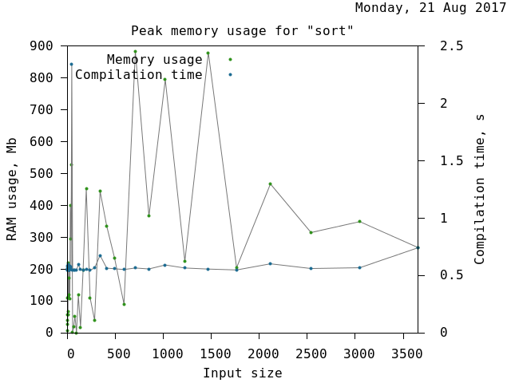

.. _testing:

*********************************************************************
                              Testing
*********************************************************************

**TODO** add some introductionary remarks.

.. _correctness:

Correctness
===========

**TODO** explain current state of affair, which compilers can compile what
which tests etc.

.. _benchmarks:

Benchmarks
==========

**TODO** explain briefly how all the tools and scripts work.

.. _test-sort:

Sort
""""

**TODO** add a short explanation of the test.

GCC-6.3.0:

Clang-4.0.0:

.. image:: ../test/benchmarks/results/sort.clang-4.0.0.png

Clang/C2:

.. image:: ../test/benchmarks/results/sort.clang-14.1.png

.. _optimisation:

Optimisation
============

**TODO** explain briefly how all the tools and scripts work.

Nested drop
"""""""""""

**TODO** add a short explanation of the test.

GCC-6.3.0:

.. literalinclude:: ../test/optimisation/results/nested.gcc-6.3.0.xml
  :language: xml

Clang-4.0.0:

.. literalinclude:: ../test/optimisation/results/nested.clang-4.0.0.xml
  :language: xml

MSVC-14.1:

.. literalinclude:: ../test/optimisation/results/nested.msvc-14.1.xml
  :language: xml
